# Architektur – Sustainable AI Gateway

Stand: 2026-08-23. Ersetzt den ursprünglichen Woche-1-Entwurf (reine
ASCII-Skizze ohne Angaben zu Plattform, Sicherheit oder tatsächlicher
Umsetzung).

Für Implementierungsdetails, Sequenzdiagramme, API-Referenz und
Datenbankschema siehe [technische Dokumentation](docs/TECHNISCHE_DOKUMENTATION.md).

## 1. System-Architektur

Grobe Sicht auf das Gateway in seiner Umgebung — welche externen Systeme es
anspricht, wo die Vertrauensgrenze liegt und auf welchen Plattformen es
läuft.

### 1.1 Systemkontext

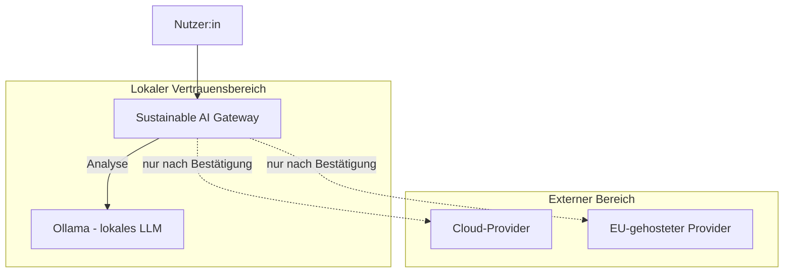

Die lokale Analyse (`/api/analyze`) verlässt den lokalen Vertrauensbereich
nie. Ein Versand an Cloud- oder EU-Provider (`/api/send`) verlangt immer
eine explizite Bestätigung im UI — Cloud-Provider bedeutet hier die native
Anthropic-API oder eine generische OpenAI-kompatible API; ein EU-Provider
nutzt dieselbe generische Schnittstelle, markiert als EU-gehostet. Details
zur Datenschutzgrenze und den vollständigen Abläufen: technische
Dokumentation, §2.

### 1.2 Plattformen

| Plattform | Status |
|---|---|
| Windows 11 (AMD, keine dedizierte GPU) | Getestet — Hauptentwicklungsumgebung |
| macOS (MacBook) | Getestet — Demo-Umgebung, Zielplattform für die Präsentation am 12.09.2026 |
| Linux | Nicht explizit getestet. Python 3.12/Flask sind plattformunabhängig, README enthält eine Linux-Installationsanleitung — sollte grundsätzlich funktionieren, ist aber ungeprüft |

Keine Containerisierung im Einsatz (Docker war laut Tasklist optional,
nicht umgesetzt). Kein Server-/Cloud-Deployment — das Gateway läuft
ausschließlich lokal auf dem jeweiligen Gerät (`flask --app app run`).

## 2. Software-Architektur

Bausteinsicht auf den Code — Schichten und ihre Verantwortlichkeiten. Für
die vollständige Datei-für-Datei-Zuordnung siehe technische Dokumentation,
§3.

### 2.1 Stationen

Der Prompt durchläuft das Gateway als Kette konkreter Stationen. Farbe zeigt
den Lösungsweg: **Web-UI** (Dashboard), **Python-Script** (deterministischer
Code), **Lokales LLM** (Ollama-Aufruf), **Ziel-LLM** (tatsächliches
Versandziel).

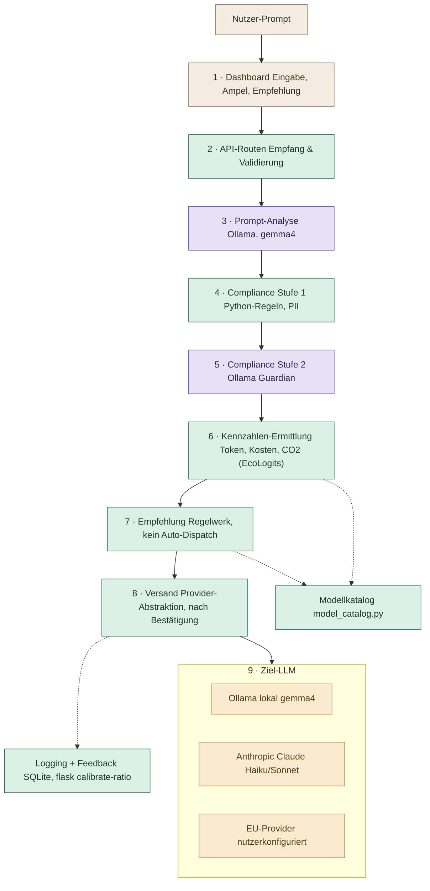

*PII = personenbezogene Daten (Personally Identifiable Information).*

| Station | Datei(en) | Was passiert |
|---|---|---|
| 1 · Dashboard | `app/templates/dashboard.html`, `app/static/js/dashboard.js` | Prompt-Eingabe, Ampel/Empfehlung anzeigen |
| 2 · API-Routen | `app/routes/api.py` | Anfrage entgegennehmen, Prompt validieren |
| 3 · Prompt-Analyse | `app/services/analysis_service.py`, `ollama_service.py` | Ollama bewertet Komplexität, Sensitivität, Kategorie |
| 4 · Compliance Stufe 1 | `app/services/compliance_service.py` | Regelbasierte PII-/Muster-Prüfung, Score berechnen |
| 5 · Compliance Stufe 2 | `app/services/guardian_service.py` | Semantische Guardian-Prüfung auf Datenschutzrisiken |
| 6 · Kennzahlen-Ermittlung | `cost_service.py`, `sustainability_service.py`, `ecologits_service.py`, `local_energy_service.py` | Token, Kosten, Energie/CO2 ermitteln |
| 7 · Empfehlung | `app/services/recommendation_service.py` | Modellklasse vorschlagen, kein Auto-Dispatch |
| 8 · Versand | `app/providers/` (Ollama, Anthropic, OpenAI-kompatibel) | Nach Bestätigung an gewählten Provider senden |
| 9 · Ziel-LLM | extern oder lokal — Ollama lokal, Anthropic API, EU-Provider | Verarbeitung außerhalb des Gateways, Antwort zurück |
| Modellkatalog | `app/services/model_catalog.py` | Preis-, Kontextfenster- und Eco-Parameter je Modellklasse |
| Logging + Feedback | `app/models.py` (`UsageLog`), `ratio_calibration_service.py` | Nutzung protokollieren, Ratio kalibrierbar |

Sicherheit (`encryption_service.py`, `url_security.py`) und Frontend-Assets
(Templates, Vanilla JS, CSS) sind Querschnittsthemen, die mehrere Stationen
betreffen, statt einer eigenen Station — siehe technische Dokumentation,
§3 und §10.

### 2.2 Architekturprinzipien

Zwei Entscheidungen sind bewusst getroffen und ziehen sich durch mehrere
Bausteine — hier festgehalten, damit sie nicht als Lücke missverstanden
werden:

- **Analyse und Versand sind technisch getrennt.** `/api/analyze` ruft nie
  einen externen Provider auf. Versand (`/api/send`) ist ein eigener,
  bewusst bestätigter Schritt.
- **Die Empfehlungs-Engine schlägt vor, sie dispatcht nicht automatisch.**
  `recommendation_service.py` berechnet eine Modellempfehlung;
  `/api/send` verschickt ausschließlich an die vom Nutzer manuell
  bestätigte Provider-/Modellwahl. Kein automatisch agierender Agent, weil
  jeder Versand laut Compliance-Konzept eine explizite Bestätigung
  braucht.

### 2.3 Weitere Bausteine im Detail

- **Compliance Stufe 1 + 2** — Detailkapitel siehe §2.5.

### 2.4 Detailkapitel: Fußabdruck-Berechnung

Ausschnitt aus der Stationenübersicht (§2.1) — hier zoomen wir in diese
beiden Stationen hinein:

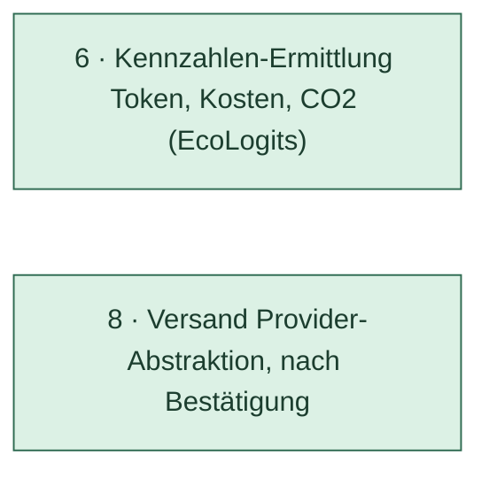

Vollständiger fachlicher Hintergrund und Entscheidungsverlauf:
[`ECOLOGITS_INTEGRATION.md`](docs/ECOLOGITS_INTEGRATION.md) und
[`CARBON_FOOTPRINT_REDESIGN.md`](docs/CARBON_FOOTPRINT_REDESIGN.md). Hier:
wo der Input herkommt, wie die Entscheidung zwischen echtem Datenbank-Treffer,
Näherung und Fallback abläuft.

#### 2.4.1 Woher der Input kommt

`compute_impacts()` (`ecologits_service.py`) wird aus drei Kontexten mit
unterschiedlichem Input aufgerufen:

| Kontext | Route | Input-Quelle |
|---|---|---|
| Vorab-Analyse | `/api/analyze` (`sustainability_for()`) | **Modellkatalog** (`model_catalog.py`) — noch kein echter Provider gewählt, nur Beispielwerte |
| Fußabdruck-Vorschau | `/api/estimate-footprint` (`estimate_footprint_for_provider()`) | **`ProviderConfiguration`** — echte, vom Nutzer gepflegte `eco_*`-Werte |
| Realer Versand | `/api/send` | Wie Vorschau, bei Ollama zusätzlich `local_energy_service.py` — echte CPU-Auslastungsmessung während der Antwortgenerierung |

#### 2.4.2 Komponenten

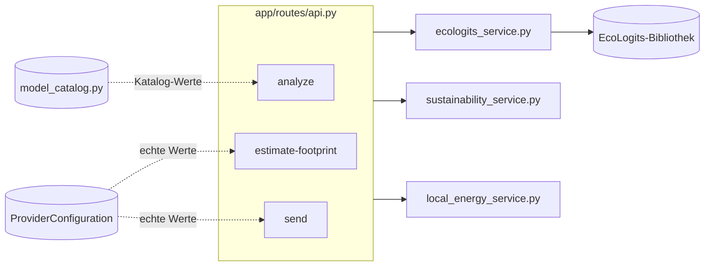

#### 2.4.3 Entscheidungslogik (Sequenzdiagramm)

Am Beispiel `/api/analyze` — `/api/send` läuft strukturell gleich, ergänzt
bei Ollama zusätzlich die lokale CPU-Messung als letzte Fallback-Stufe.

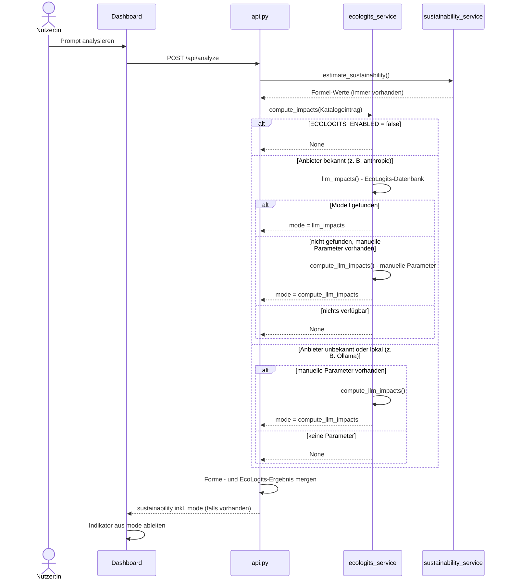

#### 2.4.4 Vom `mode`-Wert zum Indikator

| `mode` | Herkunft | Indikator im Dashboard | Bedeutung |
|---|---|---|---|
| `llm_impacts` | EcoLogits-Datenbank, bestätigter Anbieter + Modell | „EcoLogits DB" | Bestwert — echter Datenbank-Treffer |
| `compute_llm_impacts` | Manuelle Parameter (`eco_active_params_b`/`eco_total_params_b`) | „Näherung" | Schätzung ohne bestätigten DB-Eintrag |
| `local_cpu_estimate` | `psutil`-CPU-Auslastung während echtem Ollama-Send | „Lokale CPU-Schätzung" | Reale Messung, aber grobe Formel (TDP × Auslastung) |
| `formula` | Alte lineare Formel (`sustainability_service.py`) | „Grobe Schätzung" | Schwächster Fall — EcoLogits lieferte nichts |
| kein Wert | — | „Nicht verfügbar" | Kein Schätzwert für dieses Feld vorhanden |

#### 2.4.5 Vollständige Zustandsübersicht: alle Fälle

Zwei verbundene Phasen statt eines einzigen Diagramms, damit es lesbar
bleibt: **Phase 1** ist die gemeinsame Kernlogik in `compute_impacts()`, die
alle drei Aufrufer (`/api/analyze`, `/api/estimate-footprint`, `/api/send`)
gleich durchlaufen. **Phase 2** zeigt, was passiert, wenn Phase 1 `None`
liefert — und hier unterscheiden sich die Aufrufer bewusst.

**Phase 1 — `compute_impacts()`, gemeinsam für alle Aufrufer**

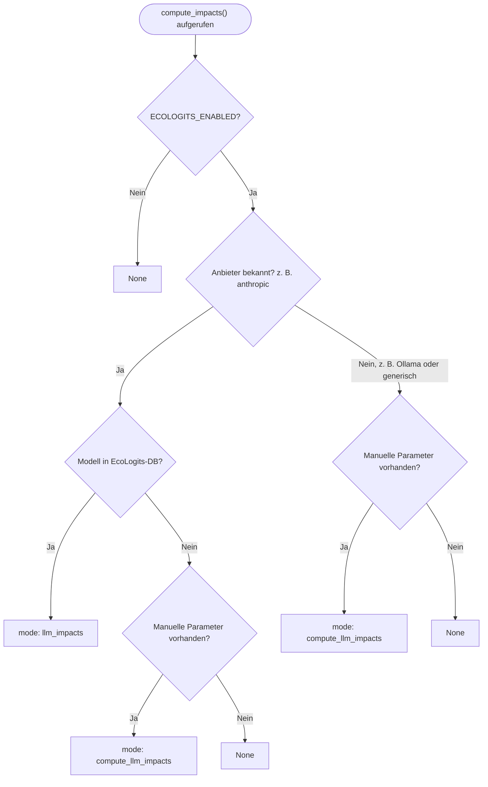

- **`ECOLOGITS_ENABLED = false`** → sofort `None`, ohne jeden weiteren
  Versuch — globaler Aus-Schalter.
- **Anbieter bekannt + Modell in DB** → `mode: llm_impacts`, Indikator
  „EcoLogits DB" — der Bestfall.
- **Anbieter bekannt + Modell nicht in DB + manuelle Parameter vorhanden**
  → `mode: compute_llm_impacts`, Indikator „Näherung" — siehe Rechen-Details
  unten.
- **Anbieter bekannt + Modell nicht in DB + keine manuellen Parameter**
  → `None`, geht weiter an Phase 2.
- **Anbieter unbekannt/lokal (z. B. Ollama) + manuelle Parameter vorhanden**
  → ebenfalls `mode: compute_llm_impacts`, „Näherung" — kein DB-Lookup wird
  hier überhaupt erst versucht, da lokale Modelle in EcoLogits' Anbieterkatalog
  strukturell nicht vorkommen.
- **Anbieter unbekannt/lokal + keine manuellen Parameter** → `None`, geht
  weiter an Phase 2.

**Phase 2 — Aufrufer-Fallback, wenn Phase 1 `None` liefert**

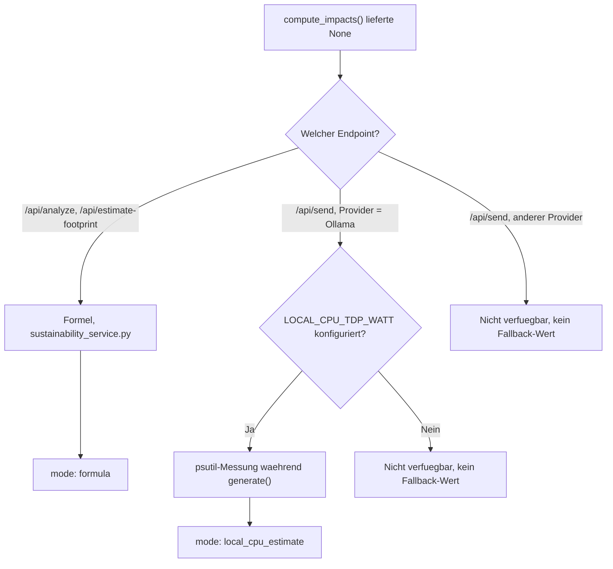

- **`/api/analyze` oder `/api/estimate-footprint`** → immer ein Formel-Ergebnis,
  `mode: formula`, Indikator „Grobe Schätzung". Diese beiden Routen sind
  Vorab-Schätzungen — ein grober Wert ist besser als gar keiner.
- **`/api/send` bei Ollama, `LOCAL_CPU_TDP_WATT` konfiguriert** → echte
  `psutil`-CPU-Auslastungsmessung *während* der tatsächlichen Antwortgenerierung,
  `mode: local_cpu_estimate`, Indikator „Lokale CPU-Schätzung" — eine reale
  Messung, keine Formel.
- **`/api/send` bei Ollama, `LOCAL_CPU_TDP_WATT` nicht konfiguriert** oder
  **`/api/send` bei jedem anderen Provider ohne Ergebnis** → **kein**
  Fallback-Wert, `sustainability` bleibt `null`, Indikator „Nicht verfügbar".

**Bewusster Unterschied zur Vorab-Schätzung**: Anders als bei `/api/analyze`
greift `/api/send` **nie** auf die Formel zurück (Kommentar im Code: „kein
Formel-Fallback, wenn EcoLogits nicht verfügbar ist — entweder eine echte
Zahl oder 0, nie ein erfundener Wert für tatsächlich versendete Prompts").
Ein tatsächlich versendeter Prompt zeigt entweder einen echten Messwert oder
ehrlich „Nicht verfügbar" — nie eine erfundene Zahl.

#### 2.4.6 Rechen-Details bei manuellen Parametern

Fließen manuelle Parameter ein (Phase 1, `mode: compute_llm_impacts`),
rechnet EcoLogits trotzdem mit derselben Methodik wie bei einem
Datenbank-Treffer — nur mit selbst hinterlegten statt bestätigten Werten:

- **`eco_active_params_b` / `eco_total_params_b`** — Aktiv-/Gesamtparameterzahl
  des Modells in Milliarden. Die Unterscheidung zählt bei
  Mixture-of-Experts-Architekturen, wo je Anfrage nicht alle Parameter aktiv
  sind.
- **`eco_datacenter_pue`** — Power Usage Effectiveness (Kühlungs-/Infrastruktur-Overhead
  des Rechenzentrums), sonst Default aus `ECOLOGITS_DEFAULT_DATACENTER_PUE`.
- **`eco_datacenter_wue`** — Water Usage Effectiveness, sonst Default aus
  `ECOLOGITS_DEFAULT_DATACENTER_WUE`.
- **Strommix-Zone** (`eco_electricity_mix_zone`) — bestimmt CO₂-Intensität,
  Wasserverbrauch und ADPe des Stroms in der jeweiligen Region, sonst Default
  aus `ECOLOGITS_ELECTRICITY_MIX_ZONE` (`DEU`).
- **Output-Tokenanzahl und Latenz** der konkreten Anfrage.

Die Parameter kommen entweder aus einer echten `ProviderConfiguration` (vom
Nutzer unter „Einstellungen" gepflegt) oder — vor der Provider-Wahl, bei
`/api/analyze` — aus den `eco_*`-Beispielwerten in `model_catalog.py`, dort
laut Kommentar im Code ausdrücklich als „illustrative Annahmen, keine
anbieterbestätigten Werte" gekennzeichnet.

**Wichtig — dieselbe Formel, andere Eingabe-Herkunft**: `compute_llm_impacts()`
ist exakt dieselbe EcoLogits-Berechnungsfunktion, die auch hinter einem
bestätigten Datenbank-Treffer steht — kein eigener, vereinfachter Ersatzweg.
Der einzige Unterschied ist die Herkunft der Eingabewerte: bestätigt aus der
EcoLogits-Datenbank vs. selbst hinterlegt. Genau deshalb heißt das Ergebnis
„Näherung" und nicht „ungültig" — die Rechenmethodik ist identisch, nur die
Vertrauenswürdigkeit der Inputs unterscheidet sich.

**So rechnet EcoLogits intern (Kurzfassung, nicht Teil unseres Codes)**:

1. GPU-Energie pro Token — Regression über die aktiven Parameter
2. Generierungsdauer — ähnliche Regression über aktive Parameter + Batch-Größe
3. Server-Energie — Dauer × Serverleistung, anteilig nach benötigter
   GPU-Anzahl (aus Gesamtparametern + Quantisierung abgeleitet)
4. Anfrage-Energie = (Server- + GPU-Energie) × PUE
5. CO₂/ADPe/PE = Anfrage-Energie × jeweiliger Strommix-Faktor
6. Wasser = IT-Energie × (WUE + PUE × Strommix-Wasserfaktor)
7. Zusätzlich ein Herstellungs-Fußabdruck (Embodied Impact) der Hardware,
   anteilig über Lebensdauer und Anfragen amortisiert — zählt zu
   GWP/ADPe/PE, nicht zu Wasser

Die genauen Regressionskoeffizienten und Hardware-Konstanten (~15 Werte,
z. B. GPU-Speicher, Server-Herstellungs-Fußabdruck, Hardware-Lebensdauer)
übernehmen wir bewusst nicht in diese Dokumentation — die gehören versioniert
in die EcoLogits-Bibliothek (`ecologits/impacts/llm.py`), nicht händisch
dupliziert hierher, sonst laufen wir bei einem EcoLogits-Update aus dem
Ruder.

### 2.5 Detailkapitel: Compliance-Prüfung

Ausschnitt aus der Stationenübersicht (§2.1) — hier zoomen wir in diese
beiden Stationen hinein:

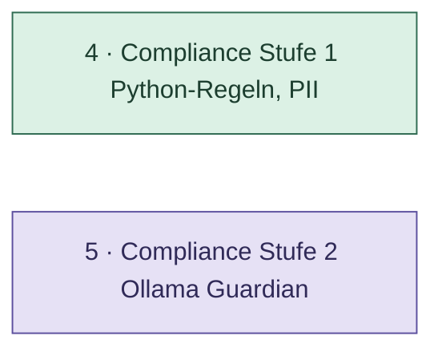

Vollständiger fachlicher Hintergrund und Entscheidungsverlauf:
[`compliance_stufe1_konzept.md`](docs/compliance_stufe1_konzept.md) und
README, Abschnitt „Compliance Stufe 2". Hier: wo der Input herkommt, wie
Stufe 1 und Stufe 2 zusammenspielen, und wie der Score im Detail entsteht.

#### 2.5.1 Woher der Input kommt

Anders als beim Fußabdruck gibt es hier nur eine Kernfunktion,
`apply_semantic_check()` (`guardian_service.py`), aufgerufen über
`inspect_prompt()`/`inspect_chat_history()` (`compliance_service.py`,
Stufe 1) aus drei Kontexten:

| Kontext | Route | Input-Umfang |
|---|---|---|
| Einzelprompt-Analyse | `/api/analyze` | Nur der aktuelle Prompt |
| Chat-Vorabprüfung | `/api/compliance/check` (Mini-Ampel im Chat) | Aktuelle Nachricht + gesamter Chatverlauf |
| Realer Versand | `/api/send` | Aktuelle Nachricht + gesamter Chatverlauf, zusätzlich blockierend bei Rot |

Bei mehreren Nachrichten gilt das Ergebnis der **schlechtesten** Einzelnachricht
für den ganzen Verlauf (`inspect_chat_history()`) — sonst ließe sich die
Prüfung über eine harmlose Schlussnachricht nach einem riskanten Verlauf
umgehen.

#### 2.5.2 Komponenten

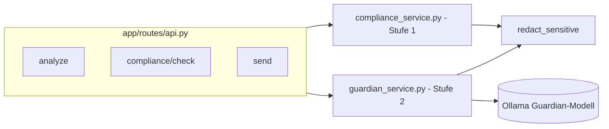

`redact_sensitive()` maskiert von Stufe 1 bereits bestätigte Werte (IBAN,
Kreditkarte, ...), bevor der Text an das Guardian-Modell geht — dieselbe
Maskierung wie vor dem Analyse-/Optimierungsaufruf an Ollama.

#### 2.5.3 Entscheidungslogik (Sequenzdiagramm)

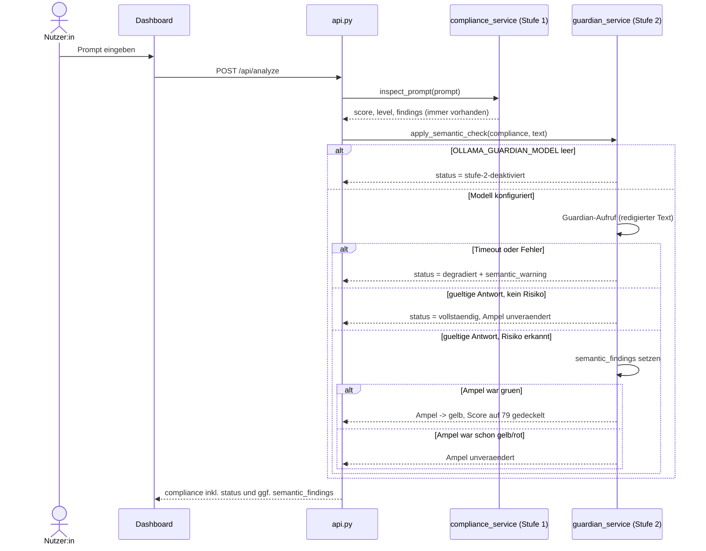

#### 2.5.4 Vom `status`-Wert zum Ergebnis

| `status` | Herkunft | Bedeutung |
|---|---|---|
| `vollständig` | Guardian erreichbar, gültige Antwort | Stufe 1 **und** Stufe 2 sind gelaufen |
| `degradiert` | Guardian-Timeout oder unparsebare Antwort | Nur Stufe 1 zählt, `semantic_warning` sichtbar |
| `stufe-2-deaktiviert` | `OLLAMA_GUARDIAN_MODEL` bewusst leer konfiguriert | Nur Stufe 1, aber kein Ausfall — bewusste Konfiguration |

Wichtig: **Rot und das serverseitige Blockieren sind ausschließlich Sache
von Stufe 1.** Stufe 2 kann eine grüne Ampel höchstens auf Gelb anheben,
nie auf Rot — und eine bereits gelbe oder rote Ampel bleibt unverändert,
auch wenn Stufe 2 zusätzlich etwas findet.

#### 2.5.5 Vollständige Zustandsübersicht: alle Fälle

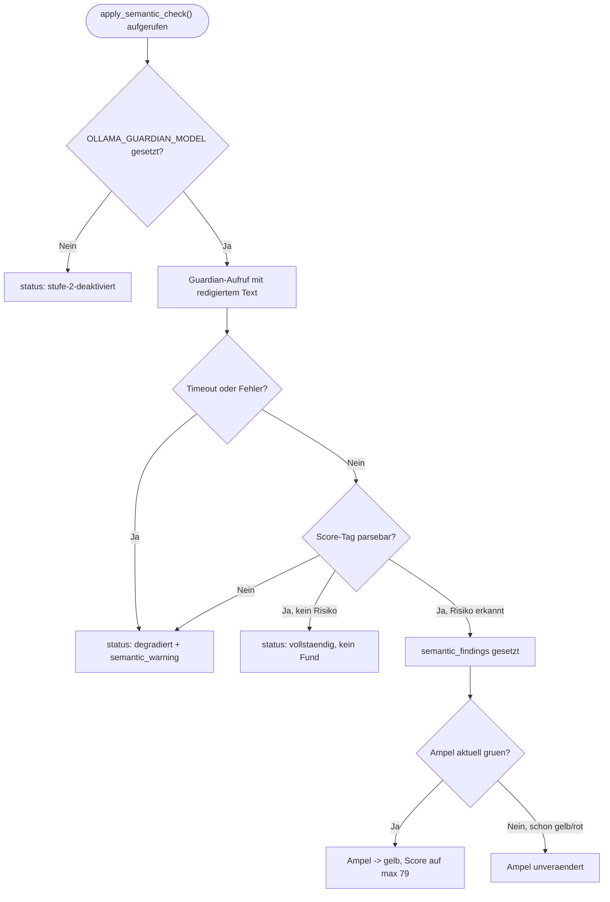

- **Kein Guardian-Modell konfiguriert** → `stufe-2-deaktiviert`, bewusst
  kein Warnhinweis (ist ja keine Störung, sondern Absicht).
- **Guardian-Timeout oder Verbindungsfehler** → `degradiert`, mit
  sichtbarem `semantic_warning` — bekanntes Live-Demo-Risiko auf
  CPU-only-Hardware, siehe Tasklist-Finding zum Guardian-Protokoll.
- **Ungültige/unparsebare Modellantwort** → ebenfalls `degradiert`,
  gleicher Warnhinweis-Mechanismus wie beim Timeout.
- **Gültige Antwort, kein Risiko** → `vollständig`, Ampel unverändert.
- **Gültige Antwort, Risiko erkannt** → `semantic_findings` gesetzt,
  `contains_personal_data = true`; Ampel steigt nur von Grün auf Gelb,
  sonst bleibt sie wie sie war.

> **Konfiguration** (`config.py`/`.env`): `OLLAMA_GUARDIAN_MODEL` — leer
> lassen deaktiviert Stufe 2 bewusst (`status: stufe-2-deaktiviert`),
> Default `granite4.1-guardian:8b`. `OLLAMA_GUARDIAN_TIMEOUT_SECONDS`
> (Default 120) — eigener Timeout statt des geteilten
> `OLLAMA_TIMEOUT_SECONDS`, adressiert das früher dokumentierte
> Guardian-Timeout-Finding (CPU-only-Hardware brauchte länger als das
> gemeinsame Zeitlimit erlaubte). `OLLAMA_GUARDIAN_KEEP_ALIVE` (Default
> `30m`) — hält die Guardian-Modellinstanz zwischen Prüfungen warm, statt
> sie bei jedem Aufruf neu zu laden.

#### 2.5.6 Rechen-Details Stufe 1 (Score-Formel)

`compliance_service.py` unterscheidet zwei Regelarten:

- **Reine Muster** (`PATTERNS`) — E-Mail, API-Schlüssel, Bearer-Token,
  privater Schlüssel, Passwort. Jeder Treffer zählt `PATTERN_PENALTY = 18`
  Punkte.
- **Validierte Muster** (`VALIDATED_PATTERNS`) — IBAN, Kreditkartennummer,
  deutsche Steuer-ID, Telefonnummer. Kandidat per Regex, **bestätigt per
  Prüfsumme** (IBAN: Mod-97/ISO 13616; Kreditkarte: Luhn; Steuer-ID: ISO
  7064 MOD 11,10) bzw. Strukturregel (Telefonnummer) — verwirft damit
  zufällige Ziffernfolgen wie Bestellnummern oder Datumsangaben. Ebenfalls
  18 Punkte je bestätigter Kategorie.
- **Schlagwörter** (`KEYWORDS`) — Gesundheitsdaten, Finanzdaten, vertrauliche
  Informationen, schädliche/rechtswidrige Anfrage, Urheberrechtsrisiko,
  Geheimnis im Klartext. Individuelles Gewicht von 12 bis 35 Punkten je
  Kategorie.

**Deckel, damit die Bewertung robust bleibt:**

- Jede Kategorie zählt **höchstens einmal**, egal wie viele Treffer der
  Text enthält.
- Drei heuristisch schwächere Kategorien (Telefonnummer, Urheberrechtsrisiko,
  Geheimnis im Klartext) tragen zusammen **höchstens 35 Punkte** bei
  (`WEAK_TOTAL_CAP`) — viele unsichere Signale allein können nie eine rote
  Bewertung erzwingen.

```text
Score = 100 - (starke Abzüge + min(schwache Abzüge, 35))
```

Score wird auf 0–100 begrenzt; Ampel-Schwellen: ≥ 80 Grün, ≥ 50 Gelb,
darunter Rot.

### 2.6 Detailkapitel: Modellauswahl

Ausschnitt aus der Stationenübersicht (§2.1) — hier zoomen wir in diese
Station hinein:

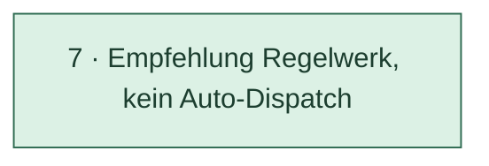

Anders als Fußabdruck und Compliance hat die Modellauswahl nur eine
einzige Funktion und einen einzigen Aufrufkontext (`recommend()` in
`recommendation_service.py`, aufgerufen aus `/api/analyze`) — deshalb hier
weniger Unterkapitel, aber dieselbe Detailtiefe an der Stelle, die es
tatsächlich hat: der Entscheidungsbaum selbst.

#### 2.6.1 Woher der Input kommt

| Eingabe | Herkunft | Bedeutung |
|---|---|---|
| Sensitivität | `analysis["sensitivity_score"]` (Ollama-Analyse) oder `compliance["contains_personal_data"/"contains_confidential_data"]` (Stufe 1+2) | Score ≥ 60 **oder** ein Compliance-Fund gilt als sensibel |
| Komplexität | `analysis["complexity_score"]` (Ollama-Analyse) | Score ≥ 70 gilt als hohe Komplexität |
| Gewählter Modus | Nutzer-Auswahl im Dashboard (`auto`/`local`/`eu`/`cloud`) | Bestimmt, welcher Zweig der Entscheidung greift |
| Kontextlänge | `input_tokens` (Token-Schätzung) | Überschreibt die Empfehlung, falls das Zielmodell ein zu kleines Kontextfenster hat |

#### 2.6.2 Komponenten

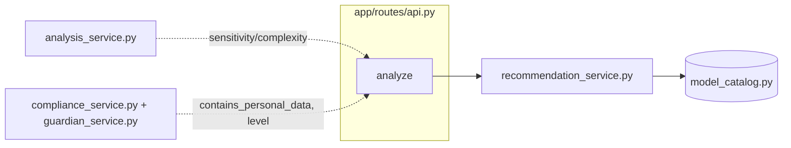

#### 2.6.3 Entscheidungslogik (vollständiger Entscheidungsbaum)

Die vier Bedingungen im Code werden strikt der Reihe nach geprüft — die
Reihenfolge selbst ist Teil der Logik, nicht nur die Bedingungen:

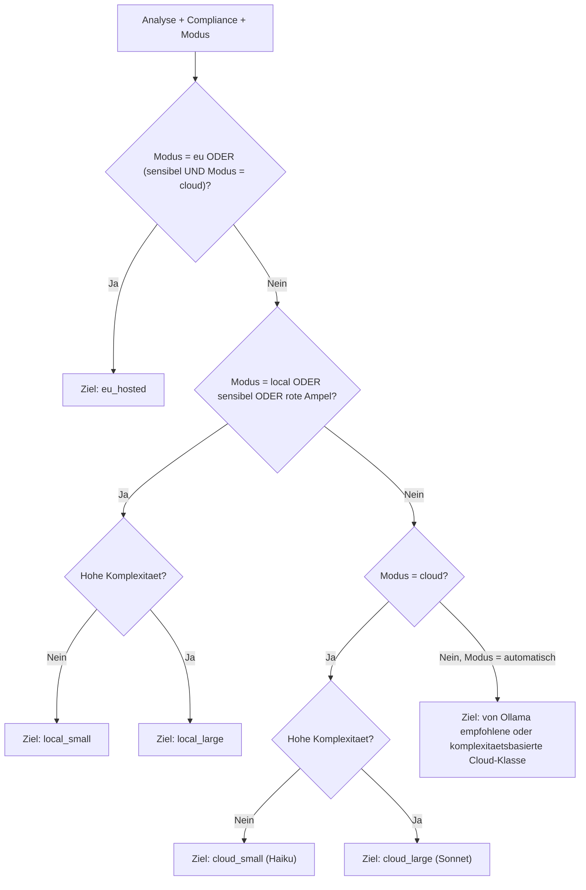

> **Ergänzt gegenüber `docs/TECHNISCHE_DOKUMENTATION.md` §7**: Die dortige
> Flowchart zeigt für „Automatisch" fälschlich „Passendes lokales Modell"
> — im Code führt der Automatik-Modus immer zu einer **Cloud**-Klasse
> (Haiku/Sonnet je Komplexität), nie zu einem lokalen Modell. Sollte dort
> ebenfalls korrigiert werden.

- **Priorität 1 — EU**: greift nicht nur bei explizitem Modus „EU", sondern
  auch dann, wenn Modus „Cloud" gewählt wurde **und** der Prompt sensibel
  ist — die Empfehlung weicht dann auf EU aus, nicht auf lokal. Eine
  bewusste Nutzerwahl (Cloud) wird also nicht komplett verworfen, nur
  sicherer gemacht.
- **Priorität 2 — Lokal**: greift bei explizitem Modus „Lokal" **oder**
  wenn der Prompt sensibel ist **oder** die Ampel bereits Rot zeigt —
  unabhängig vom gewählten Modus, solange Priorität 1 nicht schon
  gegriffen hat.
- **Priorität 3 — Cloud**: nur bei explizitem Modus „Cloud" und nicht
  sensibel.
- **Priorität 4 — Automatisch**: übernimmt `recommended_model_class` aus
  der Ollama-Analyse, falls die dort vorgeschlagene Klasse `cloud_small`
  oder `cloud_large` ist, sonst komplexitätsbasierter Fallback auf eine
  der beiden Cloud-Klassen.

> **Transparenz-Hinweis**: Der Fußabdruck (CO₂/Energie) ist **kein**
> Kriterium in dieser Entscheidung — `recommend()` bekommt ihn gar nicht
> erst übergeben (Signatur: `analysis`, `compliance`, `input_tokens`,
> `mode`), und die Fußabdruck-Berechnung (§2.4) läuft ohnehin erst
> *nachdem* das Modell hier feststeht, nie vergleichend zwischen
> Kandidaten. Ein Kriterium wie "geringerer Fußabdruck" existiert aktuell
> nicht. Passend dazu: „Carbon" steht als einer von vier Kern-Requirements
> für den in der Präsentation skizzierten, noch nicht umgesetzten
> Auto-Pilot (neben Compliant, Best Fit, Lokal-first) — eine erkannte,
> geplante Erweiterung, keine übersehene Lücke.

#### 2.6.4 Kontextfenster-Override

Unabhängig davon, welcher Zweig oben gegriffen hat: Übersteigt die
geschätzte Tokenanzahl das Kontextfenster des gewählten Modells, wird die
Empfehlung nachträglich überschrieben — auf `eu_hosted`, falls sensibel,
sonst auf `cloud_large` (das Modell mit dem größten Kontextfenster im
Katalog, 1.000.000 Token). Die regelbasierte Entscheidung ergänzt damit
die Ollama-Empfehlung, übernimmt sie aber nicht blind.
