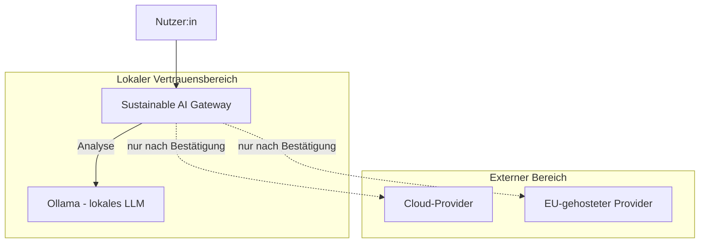
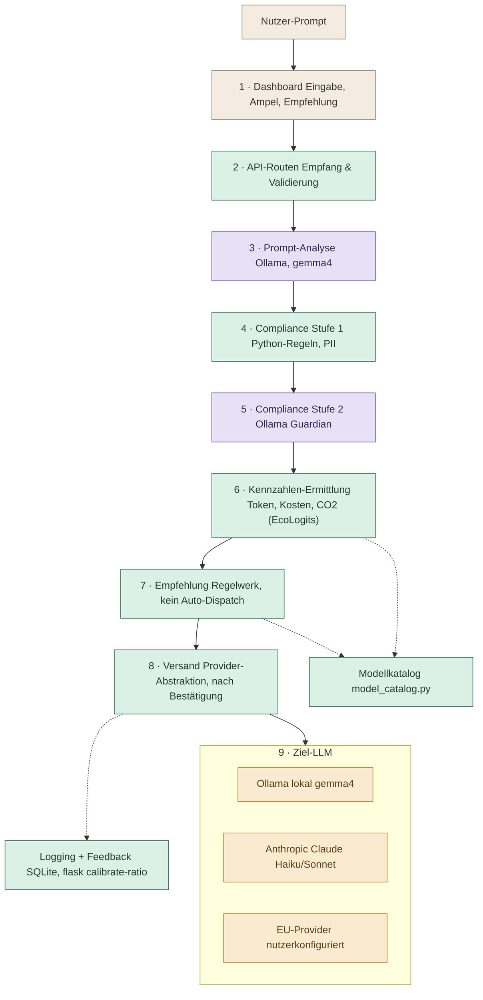
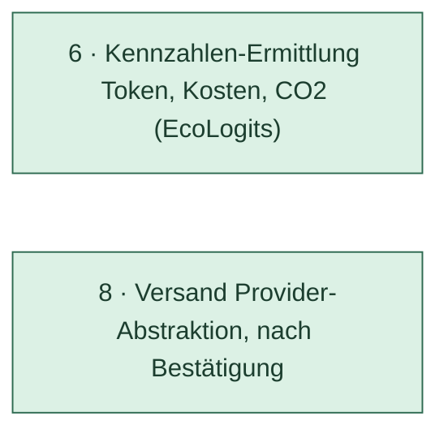
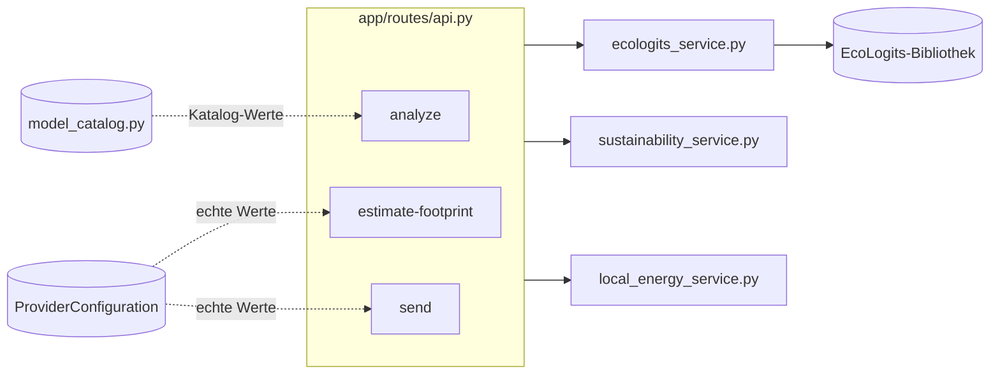
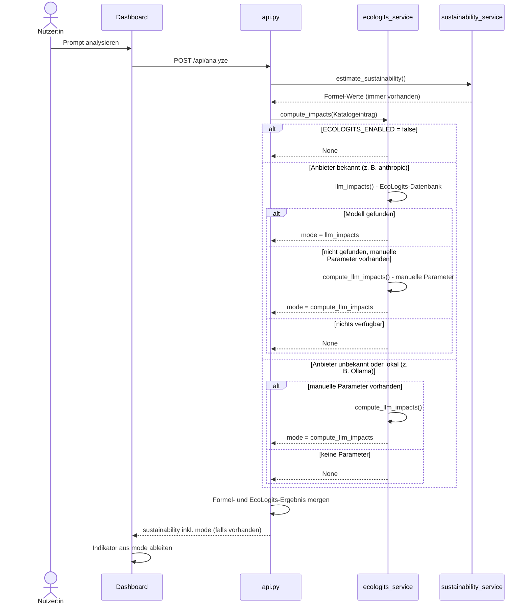
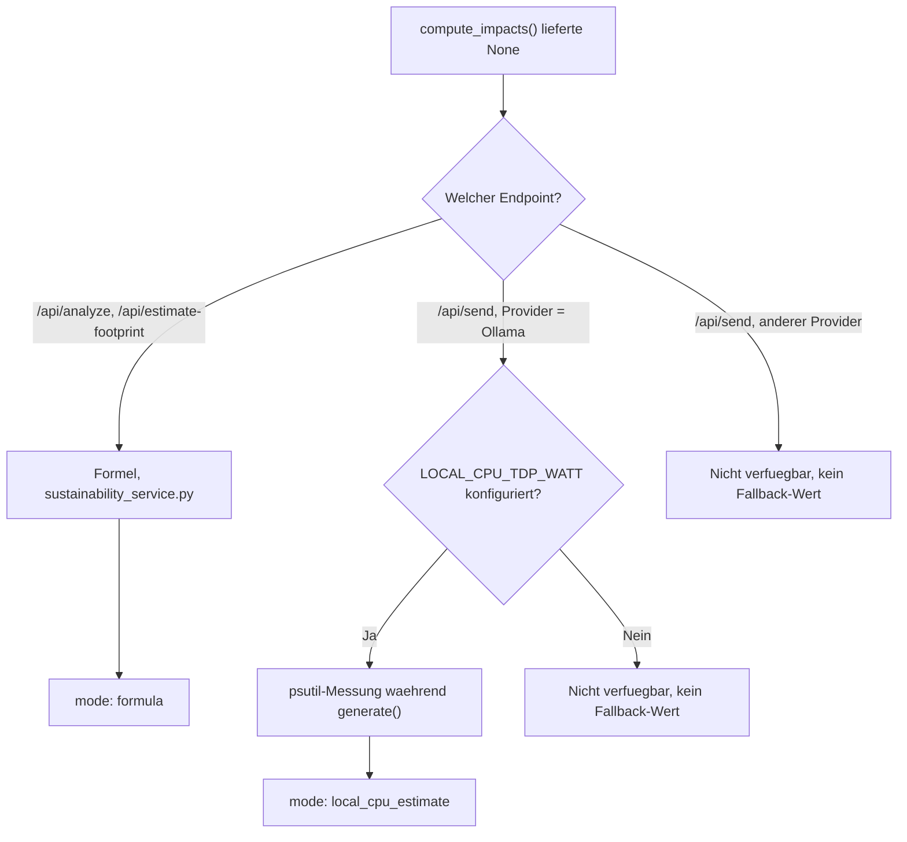

# Architektur – Sustainable AI Gateway

Stand: 2026-08-23. Ersetzt den ursprünglichen Woche-1-Entwurf (reine
ASCII-Skizze ohne Angaben zu Plattform, Sicherheit oder tatsächlicher
Umsetzung).

Für Implementierungsdetails, Sequenzdiagramme, API-Referenz und
Datenbankschema siehe [technische Dokumentation](docs/TECHNISCHE_DOKUMENTATION.md).

## 1. System-Architektur

Grobe Sicht auf das Gateway in seiner Umgebung — welche externen Systeme es
anspricht, wo die Vertrauensgrenze liegt und auf welchen Plattformen es
läuft.

### 1.1 Systemkontext

Die lokale Analyse (`/api/analyze`) verlässt den lokalen Vertrauensbereich
nie. Ein Versand an Cloud- oder EU-Provider (`/api/send`) verlangt immer
eine explizite Bestätigung im UI — Cloud-Provider bedeutet hier die native
Anthropic-API oder eine generische OpenAI-kompatible API; ein EU-Provider
nutzt dieselbe generische Schnittstelle, markiert als EU-gehostet. Details
zur Datenschutzgrenze und den vollständigen Abläufen: technische
Dokumentation, §2.

### 1.2 Plattformen

| Plattform | Status |
|---|---|
| Windows 11 (AMD, keine dedizierte GPU) | Getestet — Hauptentwicklungsumgebung |
| macOS (MacBook) | Getestet — Demo-Umgebung, Zielplattform für die Präsentation am 12.09.2026 |
| Linux | Nicht explizit getestet. Python 3.12/Flask sind plattformunabhängig, README enthält eine Linux-Installationsanleitung — sollte grundsätzlich funktionieren, ist aber ungeprüft |

Keine Containerisierung im Einsatz (Docker war laut Tasklist optional,
nicht umgesetzt). Kein Server-/Cloud-Deployment — das Gateway läuft
ausschließlich lokal auf dem jeweiligen Gerät (`flask --app app run`).

## 2. Software-Architektur

Bausteinsicht auf den Code — Schichten und ihre Verantwortlichkeiten. Für
die vollständige Datei-für-Datei-Zuordnung siehe technische Dokumentation,
§3.

### 2.1 Stationen

Der Prompt durchläuft das Gateway als Kette konkreter Stationen. Farbe zeigt
den Lösungsweg: **Web-UI** (Dashboard), **Python-Script** (deterministischer
Code), **Lokales LLM** (Ollama-Aufruf), **Ziel-LLM** (tatsächliches
Versandziel).

*PII = personenbezogene Daten (Personally Identifiable Information).*

| Station | Datei(en) | Was passiert |
|---|---|---|
| 1 · Dashboard | `app/templates/dashboard.html`, `app/static/js/dashboard.js` | Prompt-Eingabe, Ampel/Empfehlung anzeigen |
| 2 · API-Routen | `app/routes/api.py` | Anfrage entgegennehmen, Prompt validieren |
| 3 · Prompt-Analyse | `app/services/analysis_service.py`, `ollama_service.py` | Ollama bewertet Komplexität, Sensitivität, Kategorie |
| 4 · Compliance Stufe 1 | `app/services/compliance_service.py` | Regelbasierte PII-/Muster-Prüfung, Score berechnen |
| 5 · Compliance Stufe 2 | `app/services/guardian_service.py` | Semantische Guardian-Prüfung auf Datenschutzrisiken |
| 6 · Kennzahlen-Ermittlung | `cost_service.py`, `sustainability_service.py`, `ecologits_service.py`, `local_energy_service.py` | Token, Kosten, Energie/CO2 ermitteln |
| 7 · Empfehlung | `app/services/recommendation_service.py` | Modellklasse vorschlagen, kein Auto-Dispatch |
| 8 · Versand | `app/providers/` (Ollama, Anthropic, OpenAI-kompatibel) | Nach Bestätigung an gewählten Provider senden |
| 9 · Ziel-LLM | extern — Ollama lokal, Anthropic API, EU-Provider | Verarbeitung außerhalb des Gateways, Antwort zurück |
| Modellkatalog | `app/services/model_catalog.py` | Preis-, Kontextfenster- und Eco-Parameter je Modellklasse |
| Logging + Feedback | `app/models.py` (`UsageLog`), `ratio_calibration_service.py` | Nutzung protokollieren, Ratio kalibrierbar |

Sicherheit (`encryption_service.py`, `url_security.py`) und Frontend-Assets
(Templates, Vanilla JS, CSS) sind Querschnittsthemen, die mehrere Stationen
betreffen, statt einer eigenen Station — siehe technische Dokumentation,
§3 und §10.

### 2.2 Architekturprinzipien

Zwei Entscheidungen sind bewusst getroffen und ziehen sich durch mehrere
Bausteine — hier festgehalten, damit sie nicht als Lücke missverstanden
werden:

- **Analyse und Versand sind technisch getrennt.** `/api/analyze` ruft nie
  einen externen Provider auf. Versand (`/api/send`) ist ein eigener,
  bewusst bestätigter Schritt.
- **Die Empfehlungs-Engine schlägt vor, sie dispatcht nicht automatisch.**
  `recommendation_service.py` berechnet eine Modellempfehlung;
  `/api/send` verschickt ausschließlich an die vom Nutzer manuell
  bestätigte Provider-/Modellwahl. Kein automatisch agierender Agent, weil
  jeder Versand laut Compliance-Konzept eine explizite Bestätigung
  braucht.

### 2.3 Weitere Bausteine im Detail

- **Compliance Stufe 1 + 2** — regelbasierte Prüfung plus semantische
  Guardian-Prüfung, siehe [`compliance_stufe1_konzept.md`](docs/compliance_stufe1_konzept.md)
  und README, Abschnitt „Compliance Stufe 2".

### 2.4 Detailkapitel: Fußabdruck-Berechnung

Ausschnitt aus der Stationenübersicht (§2.1) — hier zoomen wir in diese
beiden Stationen hinein:

Vollständiger fachlicher Hintergrund und Entscheidungsverlauf:
[`ECOLOGITS_INTEGRATION.md`](docs/ECOLOGITS_INTEGRATION.md) und
[`CARBON_FOOTPRINT_REDESIGN.md`](docs/CARBON_FOOTPRINT_REDESIGN.md). Hier:
wo der Input herkommt, wie die Entscheidung zwischen echtem Datenbank-Treffer,
Näherung und Fallback abläuft.

#### 2.4.1 Woher der Input kommt

`compute_impacts()` (`ecologits_service.py`) wird aus drei Kontexten mit
unterschiedlichem Input aufgerufen:

| Kontext | Route | Input-Quelle |
|---|---|---|
| Vorab-Analyse | `/api/analyze` (`sustainability_for()`) | **Modellkatalog** (`model_catalog.py`) — noch kein echter Provider gewählt, nur Beispielwerte |
| Fußabdruck-Vorschau | `/api/estimate-footprint` (`estimate_footprint_for_provider()`) | **`ProviderConfiguration`** — echte, vom Nutzer gepflegte `eco_*`-Werte |
| Realer Versand | `/api/send` | Wie Vorschau, bei Ollama zusätzlich `local_energy_service.py` — echte CPU-Auslastungsmessung während der Antwortgenerierung |

#### 2.4.2 Komponenten

#### 2.4.3 Entscheidungslogik (Sequenzdiagramm)

Am Beispiel `/api/analyze` — `/api/send` läuft strukturell gleich, ergänzt
bei Ollama zusätzlich die lokale CPU-Messung als letzte Fallback-Stufe.

#### 2.4.4 Vom `mode`-Wert zum Indikator

| `mode` | Herkunft | Indikator im Dashboard | Bedeutung |
|---|---|---|---|
| `llm_impacts` | EcoLogits-Datenbank, bestätigter Anbieter + Modell | „EcoLogits DB" | Bestwert — echter Datenbank-Treffer |
| `compute_llm_impacts` | Manuelle Parameter (`eco_active_params_b`/`eco_total_params_b`) | „Näherung" | Schätzung ohne bestätigten DB-Eintrag |
| `local_cpu_estimate` | `psutil`-CPU-Auslastung während echtem Ollama-Send | „Lokale CPU-Schätzung" | Reale Messung, aber grobe Formel (TDP × Auslastung) |
| `formula` | Alte lineare Formel (`sustainability_service.py`) | „Grobe Schätzung" | Schwächster Fall — EcoLogits lieferte nichts |
| kein Wert | — | „Nicht verfügbar" | Kein Schätzwert für dieses Feld vorhanden |

#### 2.4.5 Vollständige Zustandsübersicht: alle Fälle

Zwei verbundene Phasen statt eines einzigen Diagramms, damit es lesbar
bleibt: **Phase 1** ist die gemeinsame Kernlogik in `compute_impacts()`, die
alle drei Aufrufer (`/api/analyze`, `/api/estimate-footprint`, `/api/send`)
gleich durchlaufen. **Phase 2** zeigt, was passiert, wenn Phase 1 `None`
liefert — und hier unterscheiden sich die Aufrufer bewusst.

**Phase 1 — `compute_impacts()`, gemeinsam für alle Aufrufer**

- **`ECOLOGITS_ENABLED = false`** → sofort `None`, ohne jeden weiteren
  Versuch — globaler Aus-Schalter.
- **Anbieter bekannt + Modell in DB** → `mode: llm_impacts`, Indikator
  „EcoLogits DB" — der Bestfall.
- **Anbieter bekannt + Modell nicht in DB + manuelle Parameter vorhanden**
  → `mode: compute_llm_impacts`, Indikator „Näherung" — siehe Rechen-Details
  unten.
- **Anbieter bekannt + Modell nicht in DB + keine manuellen Parameter**
  → `None`, geht weiter an Phase 2.
- **Anbieter unbekannt/lokal (z. B. Ollama) + manuelle Parameter vorhanden**
  → ebenfalls `mode: compute_llm_impacts`, „Näherung" — kein DB-Lookup wird
  hier überhaupt erst versucht, da lokale Modelle in EcoLogits' Anbieterkatalog
  strukturell nicht vorkommen.
- **Anbieter unbekannt/lokal + keine manuellen Parameter** → `None`, geht
  weiter an Phase 2.

**Phase 2 — Aufrufer-Fallback, wenn Phase 1 `None` liefert**

- **`/api/analyze` oder `/api/estimate-footprint`** → immer ein Formel-Ergebnis,
  `mode: formula`, Indikator „Grobe Schätzung". Diese beiden Routen sind
  Vorab-Schätzungen — ein grober Wert ist besser als gar keiner.
- **`/api/send` bei Ollama, `LOCAL_CPU_TDP_WATT` konfiguriert** → echte
  `psutil`-CPU-Auslastungsmessung *während* der tatsächlichen Antwortgenerierung,
  `mode: local_cpu_estimate`, Indikator „Lokale CPU-Schätzung" — eine reale
  Messung, keine Formel.
- **`/api/send` bei Ollama, `LOCAL_CPU_TDP_WATT` nicht konfiguriert** oder
  **`/api/send` bei jedem anderen Provider ohne Ergebnis** → **kein**
  Fallback-Wert, `sustainability` bleibt `null`, Indikator „Nicht verfügbar".

**Bewusster Unterschied zur Vorab-Schätzung**: Anders als bei `/api/analyze`
greift `/api/send` **nie** auf die Formel zurück (Kommentar im Code: „kein
Formel-Fallback, wenn EcoLogits nicht verfügbar ist — entweder eine echte
Zahl oder 0, nie ein erfundener Wert für tatsächlich versendete Prompts").
Ein tatsächlich versendeter Prompt zeigt entweder einen echten Messwert oder
ehrlich „Nicht verfügbar" — nie eine erfundene Zahl.

#### 2.4.6 Rechen-Details bei manuellen Parametern

Fließen manuelle Parameter ein (Phase 1, `mode: compute_llm_impacts`),
rechnet EcoLogits trotzdem mit derselben Methodik wie bei einem
Datenbank-Treffer — nur mit selbst hinterlegten statt bestätigten Werten:

- **`eco_active_params_b` / `eco_total_params_b`** — Aktiv-/Gesamtparameterzahl
  des Modells in Milliarden. Die Unterscheidung zählt bei
  Mixture-of-Experts-Architekturen, wo je Anfrage nicht alle Parameter aktiv
  sind.
- **`eco_datacenter_pue`** — Power Usage Effectiveness (Kühlungs-/Infrastruktur-Overhead
  des Rechenzentrums), sonst Default aus `ECOLOGITS_DEFAULT_DATACENTER_PUE`.
- **`eco_datacenter_wue`** — Water Usage Effectiveness, sonst Default aus
  `ECOLOGITS_DEFAULT_DATACENTER_WUE`.
- **Strommix-Zone** (`eco_electricity_mix_zone`) — bestimmt CO₂-Intensität,
  Wasserverbrauch und ADPe des Stroms in der jeweiligen Region, sonst Default
  aus `ECOLOGITS_ELECTRICITY_MIX_ZONE` (`DEU`).
- **Output-Tokenanzahl und Latenz** der konkreten Anfrage.

Die Parameter kommen entweder aus einer echten `ProviderConfiguration` (vom
Nutzer unter „Einstellungen" gepflegt) oder — vor der Provider-Wahl, bei
`/api/analyze` — aus den `eco_*`-Beispielwerten in `model_catalog.py`, dort
laut Kommentar im Code ausdrücklich als „illustrative Annahmen, keine
anbieterbestätigten Werte" gekennzeichnet.

**Wichtig — dieselbe Formel, andere Eingabe-Herkunft**: `compute_llm_impacts()`
ist exakt dieselbe EcoLogits-Berechnungsfunktion, die auch hinter einem
bestätigten Datenbank-Treffer steht — kein eigener, vereinfachter Ersatzweg.
Der einzige Unterschied ist die Herkunft der Eingabewerte: bestätigt aus der
EcoLogits-Datenbank vs. selbst hinterlegt. Genau deshalb heißt das Ergebnis
„Näherung" und nicht „ungültig" — die Rechenmethodik ist identisch, nur die
Vertrauenswürdigkeit der Inputs unterscheidet sich.

**So rechnet EcoLogits intern (Kurzfassung, nicht Teil unseres Codes)**:

1. GPU-Energie pro Token — Regression über die aktiven Parameter
2. Generierungsdauer — ähnliche Regression über aktive Parameter + Batch-Größe
3. Server-Energie — Dauer × Serverleistung, anteilig nach benötigter
   GPU-Anzahl (aus Gesamtparametern + Quantisierung abgeleitet)
4. Anfrage-Energie = (Server- + GPU-Energie) × PUE
5. CO₂/ADPe/PE = Anfrage-Energie × jeweiliger Strommix-Faktor
6. Wasser = IT-Energie × (WUE + PUE × Strommix-Wasserfaktor)
7. Zusätzlich ein Herstellungs-Fußabdruck (Embodied Impact) der Hardware,
   anteilig über Lebensdauer und Anfragen amortisiert — zählt zu
   GWP/ADPe/PE, nicht zu Wasser

Die genauen Regressionskoeffizienten und Hardware-Konstanten (~15 Werte,
z. B. GPU-Speicher, Server-Herstellungs-Fußabdruck, Hardware-Lebensdauer)
übernehmen wir bewusst nicht in diese Dokumentation — die gehören versioniert
in die EcoLogits-Bibliothek (`ecologits/impacts/llm.py`), nicht händisch
dupliziert hierher, sonst laufen wir bei einem EcoLogits-Update aus dem
Ruder.
