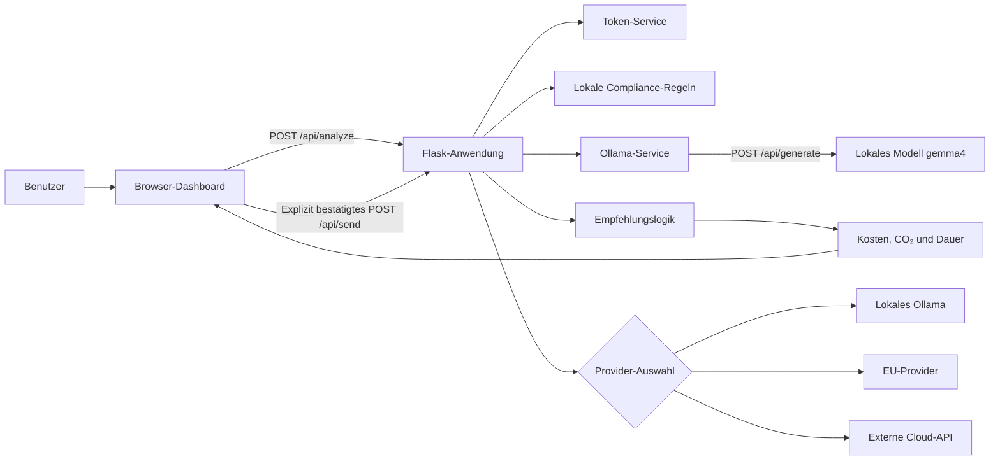
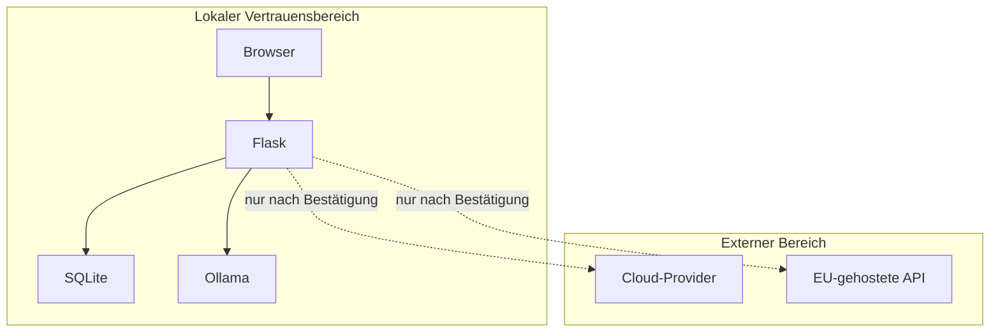
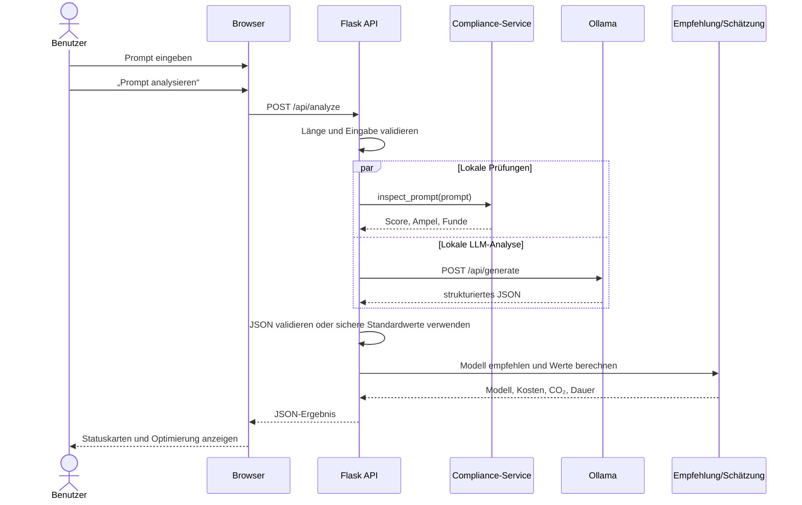
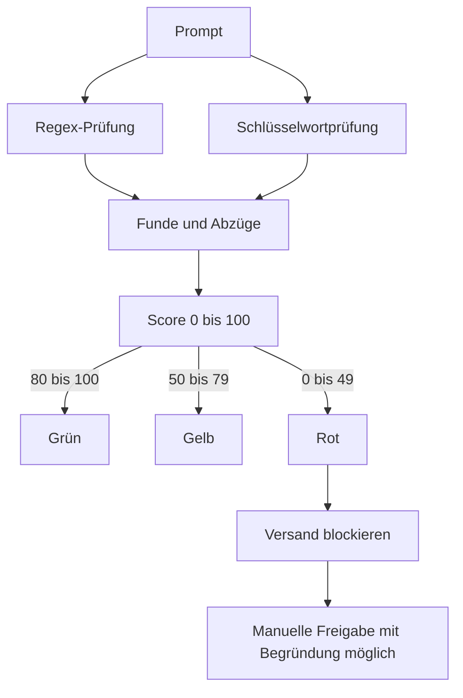
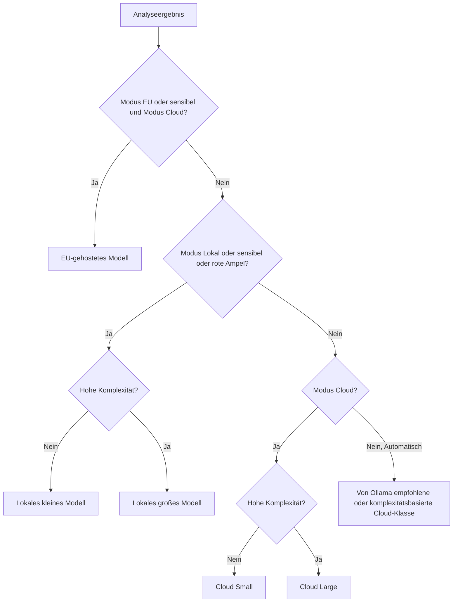
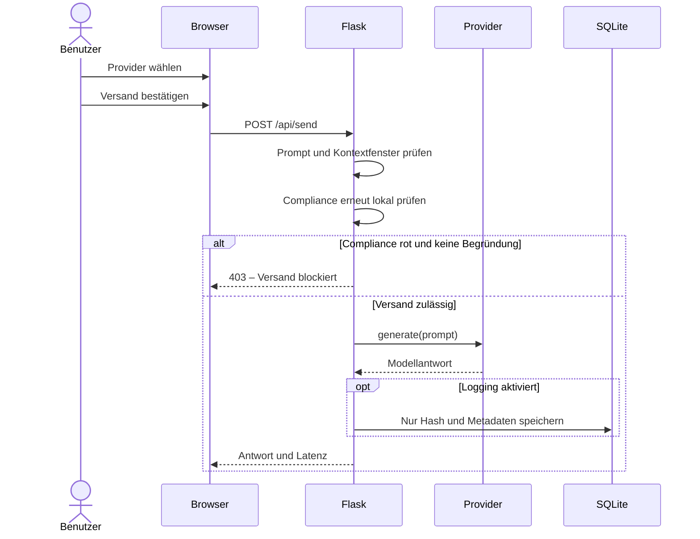
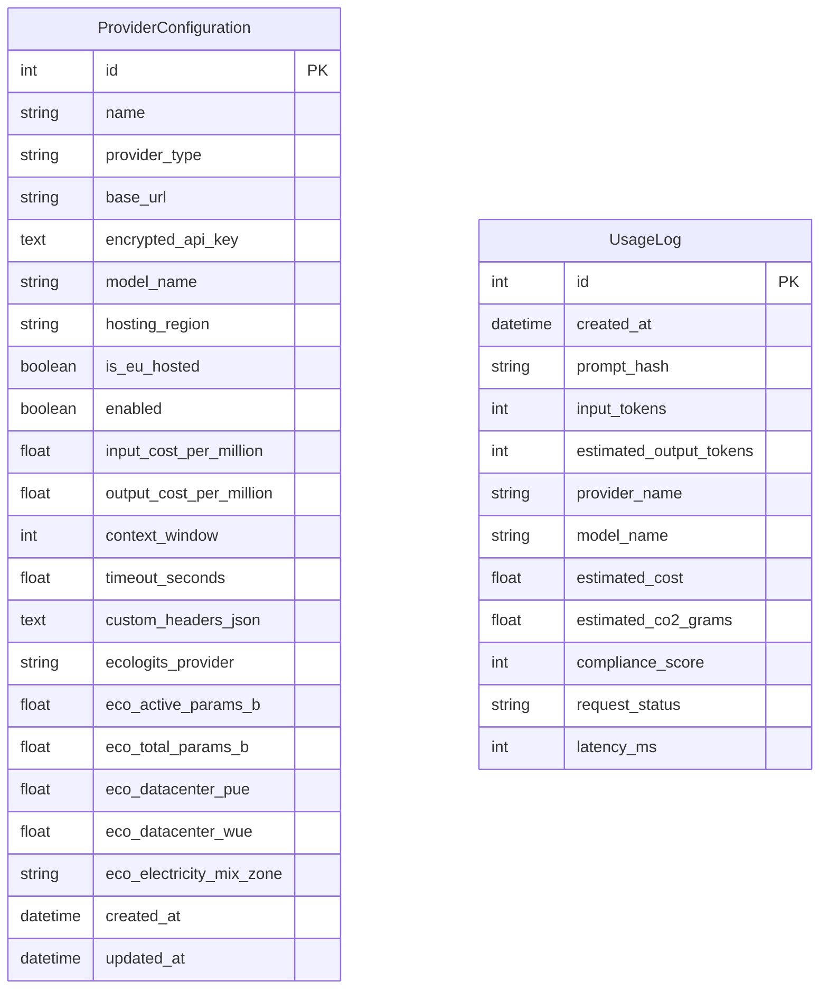

# Technische Dokumentation – Sustainable AI Gateway

## 1. Ziel des Programms

Das Sustainable AI Gateway untersucht einen Prompt, **bevor** er an ein KI-Modell gesendet wird. Die Anwendung bewertet:

- geschätzte Tokenanzahl,
- mögliche Compliance- und Datenschutzrisiken,
- geschätzte Kosten,
- geschätzten Energieverbrauch und CO₂-Ausstoß,
- geschätzte Verarbeitungsdauer,
- passende Modellklasse und Hosting-Region.

Die Analyse wird bevorzugt lokal über Ollama ausgeführt. Ein Prompt wird niemals allein durch die Analyse an einen externen Provider übertragen. Analyse und Versand sind zwei getrennte Benutzeraktionen.

## 2. Systemübersicht



### Zentrale Datenschutzgrenze



## 3. Komponenten und Dateien

| Komponente | Datei | Aufgabe |
|---|---|---|
| Startpunkt | `app.py` | Erstellt und startet die Flask-Anwendung |
| Konfiguration | `config.py` | Liest Datenbank-, Ollama-, Sicherheits- und Schätzparameter |
| App-Factory | `app/__init__.py` | Initialisiert Flask, Datenbank, Blueprints, CSRF und Security Header |
| Datenbankmodelle | `app/models.py` | Provider-Konfigurationen und optionale Nutzungslogs |
| API-Routen | `app/routes/api.py` | Analyse, Versand, Providerverwaltung und Statusendpunkte |
| HTML-Routen | `app/routes/main.py` | Dashboard, Datenschutz- und Info-Seite |
| Einstellungen | `app/routes/settings.py` | Provider-Einstellungsseite |
| Compliance | `app/services/compliance_service.py` | Regex-, Schlüsselwort- und Maskierungsregeln |
| Ollama-Analyse | `app/services/analysis_service.py` | System-Prompt, JSON-Validierung und sichere Standardwerte |
| Ollama-Client | `app/services/ollama_service.py` | HTTP-Kommunikation mit Ollama |
| Token-Schätzung | `app/services/token_service.py` | Lokale Token-Näherung |
| Empfehlung | `app/services/recommendation_service.py` | Regelbasierte Modellwahl |
| Schätzwerte | `app/services/cost_service.py`, `sustainability_service.py` | Kosten-, Energie-, CO₂- und Dauerberechnung (Fallback-Formel) |
| EcoLogits-Anbindung | `app/services/ecologits_service.py` | Methodikbasierte Energie-/CO₂-/Wasser-/ADPe-Berechnung, siehe [`ECOLOGITS_INTEGRATION.md`](ECOLOGITS_INTEGRATION.md) |
| Lokale Energie-Schätzung | `app/services/local_energy_service.py` | CPU-Auslastungsformel für den lokalen Ollama-Sendefall (Fallback, wenn EcoLogits keinen Wert liefert) |
| Modellkatalog | `app/services/model_catalog.py` | Konfigurierbare Demo-Modelle und Faktoren |
| Verschlüsselung | `app/services/encryption_service.py` | Fernet-Verschlüsselung und Maskierung von API-Schlüsseln |
| SSRF-Schutz | `app/services/url_security.py` | Prüft Provider-URLs und blockiert interne Netze |
| Provider-Abstraktion | `app/providers/` | Einheitliche Schnittstelle für Ollama und OpenAI-kompatible APIs |
| Dashboard | `app/templates/dashboard.html`, `app/static/js/dashboard.js` | Eingabe, Anzeige, Bestätigung und API-Aufrufe |

## 4. Ablauf der Prompt-Analyse



### Fehlerfall bei Ollama

Kann Ollama nicht erreicht werden oder liefert das Modell kein valides JSON, entsteht kein Serverfehler. `parse_analysis()` versucht zuerst, ein JSON-Objekt aus der Antwort zu extrahieren. Falls das nicht gelingt, verwendet die Anwendung definierte Standardwerte und zeigt eine Warnung an. Die lokalen Compliance-Regeln laufen trotzdem.

## 5. Compliance-Bewertung

Die Regeln liegen in `app/services/compliance_service.py`.

### 5.1 Formatbasierte Regeln

`PATTERNS` enthält reine Regex-Erkennung (ohne weitere Prüfung) für:

- E-Mail-Adressen,
- API-Schlüssel,
- Bearer Tokens,
- private Schlüssel,
- Klartext-Passwörter.

`VALIDATED_PATTERNS` erkennt zusätzlich Kandidaten per Regex, verwirft aber
alle, die eine zugehörige Prüfsumme bzw. Strukturregel nicht bestehen — das
vermeidet Fehlalarme bei zufälligen Ziffernfolgen (Bestellnummern,
Seriennummern, Daten):

- IBAN (Mod-97-Prüfsumme, ISO 13616, unterstützte Länderlängen in
  `IBAN_LENGTHS`),
- Kreditkartennummer (Luhn-Algorithmus),
- Deutsche Steuer-ID (Prüfziffer nach ISO 7064 / MOD 11,10),
- Telefonnummer (Ziffernlängen-Heuristik, schließt Datums- und
  Segment-Muster wie `01/02/2023` explizit aus).

### 5.2 Inhaltsbasierte Regeln

`KEYWORDS` erkennt unter anderem:

- Gesundheitsdaten,
- Finanzdaten,
- vertrauliche Informationen,
- schädliche oder möglicherweise rechtswidrige Anforderungen,
- Urheberrechtsrisiken,
- Geheimnisse im Klartext.

Jede Regel besitzt einen Punkteabzug. Die Berechnung beginnt bei 100:

```text
Compliance-Score = 100 - Summe der erkannten Risikoabzüge
```

Der Score wird auf den Bereich 0 bis 100 begrenzt.

| Score | Ampel | Bedeutung |
|---:|---|---|
| 80–100 | Grün | Kein oder geringes lokal erkanntes Risiko |
| 50–79 | Gelb | Prompt sollte vor Versand geprüft und anonymisiert werden |
| 0–49 | Rot | Externer Versand ist standardmäßig blockiert |



### 5.3 Neue Compliance-Regel ergänzen

Eine neue Schlüsselwortregel kann beispielsweise so ergänzt werden:

```python
KEYWORDS = {
    # bestehende Regeln
    "Personaldaten": (
        r"(?i)\b(personalakte|mitarbeiternummer|abmahnung|kündigungsgrund)\b",
        20,
    ),
}
```

Eine neue Formatregel wird in `PATTERNS` ergänzt:

```python
PATTERNS = {
    # bestehende Regeln
    "Interne Kundennummer": r"\bKD-[0-9]{8}\b",
}
```

Danach sollte mindestens ein positiver und ein negativer Test in `tests/test_services.py` ergänzt werden. Zu allgemeine Begriffe erzeugen Fehlalarme; präzise Wortgrenzen und konkrete Formate sind deshalb wichtig.

## 6. Berechnungen

### Token

```text
geschätzte Token = max(1, round(Zeichenanzahl / 4))
```

Die erwarteten Output-Token (Basis für Kosten-, Energie- und Dauerschätzung) ergeben
sich proportional zur Eingabelänge:

```text
erwartete Output-Token = max(1, round(Input-Token × EXPECTED_OUTPUT_RATIO))
```

`EXPECTED_OUTPUT_RATIO` ist ein konfigurierbarer Faktor (`config.py`, Default `6`).
Der CLI-Befehl `flask calibrate-ratio` schlägt einen kalibrierten Wert aus echten
`UsageLog`-Daten vor: Median aus `estimated_output_tokens / input_tokens` über alle
erfolgreichen Sends (`request_status == "success"`), erst ab einer Mindeststichprobe
von 20 Sends und nur bei aktivem `ENABLE_PROMPT_LOGGING`
(`app/services/ratio_calibration_service.py`). Der Befehl ändert `.env` nicht
automatisch — die Übernahme des Vorschlags bleibt manuell.

### Kosten

```text
Input-Kosten  = Input-Token / 1.000.000 × Input-Preis
Output-Kosten = Output-Token / 1.000.000 × Output-Preis
Gesamtkosten  = Input-Kosten + Output-Kosten
```

### Energie und CO₂

Primär berechnet `app/services/ecologits_service.py` (`compute_impacts`) die Werte über die
EcoLogits-Bibliothek — Details, konfigurierbare Parameter und Rangfolge (Provider →
Modellkatalog → globale Konfiguration) siehe [`ECOLOGITS_INTEGRATION.md`](ECOLOGITS_INTEGRATION.md).
Ist EcoLogits deaktiviert, nicht installierbar oder liefert keinen Wert (z. B. fehlende
Parameteranzahl, unbekanntes Modell), greift als Fallback die folgende einfache Formel aus
`sustainability_service.py`:

```text
Energie = Input-Token / 1.000 × Input-Energiefaktor
        + Output-Token / 1.000 × Output-Energiefaktor

CO₂e = Energie × CO₂-Intensität
```

Für den tatsächlichen Versand an einen lokalen Ollama-Provider gibt es einen
dritten, eigenständigen Pfad: `app/services/local_energy_service.py`
(`measure_local_generation`) schätzt Energie/CO₂ aus der tatsächlichen
CPU-Auslastung während des Sendevorgangs (TDP × Auslastung × Dauer, konfiguriert
über `LOCAL_CPU_TDP_WATT`) — als Fallback, wenn weder ein bestätigter
EcoLogits-Anbieter noch manuelle Parameter für das lokale Modell hinterlegt
sind. Liefert nur Energie/CO₂, nie Wasser/ADPe (methodisch nicht ableitbar aus
einer reinen CPU-Auslastungsmessung). Details siehe
[`CARBON_FOOTPRINT_REDESIGN.md`](CARBON_FOOTPRINT_REDESIGN.md), Nachtrag 24.

Ein früherer Vorher/Nachher-Vergleich zwischen Original- und optimiertem Prompt sowie eine
separate "Stromkosten"-Kennzahl für lokale Modelle wurden wieder entfernt (strukturell
irreführend bzw. Ersatz über CodeCarbon vorgesehen) — Details und Begründung siehe
[`CARBON_FOOTPRINT_REDESIGN.md`](CARBON_FOOTPRINT_REDESIGN.md).

### Dauer

Die Dauer ist eine Heuristik aus Grundlatenz, Input- und Output-Token, Modellklasse und Komplexität. Angezeigt wird ein Intervall. Alle Werte sind Näherungen und keine wissenschaftlichen Messungen oder Preisgarantien.

## 7. Modellempfehlung



Die Bedingungen werden strikt der Reihe nach geprüft: Ein sensibler Prompt
bei explizit gewähltem Modus „Cloud" weicht auf EU aus, nicht auf lokal —
nur wenn kein EU-Fall vorliegt, greift die Sensibel-/Rot-Regel zugunsten
eines lokalen Modells. Details siehe [Architektur.md](../Architektur.md)
§2.6.

Bei zu langem Kontext wird zusätzlich geprüft, ob das Kontextfenster des Modells ausreicht. Die regelbasierte Entscheidung ergänzt die Ollama-Empfehlung und übernimmt sie nicht blind.

**Bewusst kein automatischer Dispatch:** Dieser Abschnitt berechnet ausschließlich eine *Empfehlung*. `/api/send` verschickt immer an die vom Nutzer im UI manuell bestätigte Provider-/Modellwahl, nicht automatisch an das hier empfohlene Modell — eine bewusste Design-Entscheidung, keine unfertige Automatisierung, da jeder Versand eine explizite Bestätigung voraussetzt (siehe „Versandablauf" oben).

## 8. Versandablauf



## 9. Datenbank



Zwischen den Tabellen besteht bewusst kein Fremdschlüssel. Nutzungslogs bleiben auch verständlich, wenn eine Provider-Konfiguration später gelöscht wird.

## 10. Sicherheitskonzept

- API-Schlüssel werden mit Fernet verschlüsselt.
- Der Schlüssel selbst kommt ausschließlich aus `APP_ENCRYPTION_KEY`.
- API-Schlüssel werden im Browser nur maskiert dargestellt.
- Verändernde Requests benötigen ein CSRF-Token.
- Eine Content Security Policy begrenzt Browserressourcen.
- `X-Content-Type-Options: nosniff` verhindert MIME-Sniffing.
- Provider-URLs dürfen nur HTTP oder HTTPS verwenden.
- Private und interne IP-Bereiche sind für externe Provider blockiert.
- Localhost ist nur für Ollama zulässig.
- Provider-Redirects sind deaktiviert.
- Prompts werden standardmäßig nicht gespeichert.
- Optionales Logging enthält nur Prompt-Hash und Metadaten.

## 11. API-Übersicht

| Methode | Route | Funktion |
|---|---|---|
| GET | `/` | Dashboard |
| GET | `/settings/providers` | Providerverwaltung |
| GET | `/privacy` | Datenschutzhinweise |
| GET | `/info` | Version, Autoren, Disclaimer |
| POST | `/api/analyze` | Prompt lokal analysieren und Werte schätzen |
| POST | `/api/estimate-footprint` | Fußabdruck für aktuellen Text/Provider neu schätzen, ohne Ollama-Aufruf oder Versand |
| POST | `/api/optimize` | Optimierten Prompt ermitteln |
| POST | `/api/send` | Prompt nach Bestätigung versenden |
| GET/POST | `/api/providers` | Provider auflisten oder anlegen |
| PUT/DELETE | `/api/providers/<id>` | Provider bearbeiten oder löschen |
| POST | `/api/providers/<id>/test` | Verbindung testen |
| GET | `/api/providers/<id>/models` | Provider-Modelle abrufen |
| GET | `/api/ollama/status` | Ollama- und Modellstatus prüfen |
| GET | `/api/ollama/models` | Lokale Modelle abrufen |
| GET | `/api/usage/summary` | Zusammenfassung optionaler Nutzungslogs |

## 12. Tests und Erweiterung

```powershell
python -m pytest -q
```

Die Tests decken Token-, Compliance-, Maskierungs-, Kosten-, CO₂-, EcoLogits-, Empfehlungs-, Ollama-, Verschlüsselungs-, Routing-, EU-, CSRF/MIME- und SSRF-Verhalten ab. Bei einer Erweiterung sollte immer zuerst der Service angepasst und danach ein passender Test ergänzt werden.

